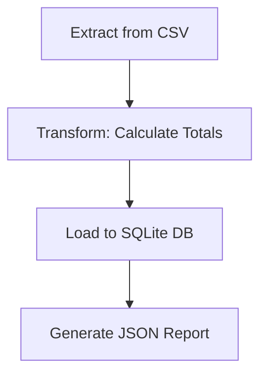

# Data Pipeline

## Business Problem
A retail company needed to automate processing sales data from CSV files to generate daily sales reports, replacing manual Excel work that was error-prone and time-consuming.

## Solution
Built a simple ETL pipeline using Python's built-in csv and sqlite3 modules. The pipeline extracts sales data from CSV, calculates totals for each transaction, loads the data into a SQLite database, and generates a summary report.

## Outcome
- Automated daily reporting process
- Reduced errors from manual calculations
- Enabled quick access to sales metrics

## Architecture Diagram

